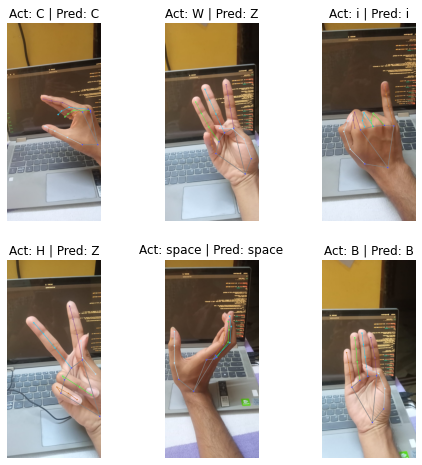

# **SignLangGNN**

<p align="center">
  
</p>


When **GNNs** 💜 **MediaPipe**. This is a starter project where I tried to implement some traditional image classification problem i.e. the ASL sign language classification problem. The twist here is we used the **graph** generated from the hand images using mediapipe. And the graph I got, I extrated the `{x, y, z}` co-ordinates of the nodes and also the edge index for the connecteion and translated this image classification problem to a graph classiciation problem. 

**Project Structure**
```
--------- Data
            |___ CSVs # containing the co-ordinates of per images
            |___ raw
                   |___ train.csv
                   |___ valid.csv
                   |___ test.csv 
            |___ ImageData
                   |___ asl_alphabet_test
                            |___ A/
                            |___ B/ 
                            ....
                            |___ space

                   |___ asl_alphabet_train
            |
            |___ Models # the GNN models
            |___ src
                   |__ dataset.py # pyg custom data
                   |__ train.py   # train loop
                   |__ utils.py   # different utility functions
            |
            |___ main.py # from data to train
            |___ run.py  # real time video visualization
```
I used `PyTorch geometric` and `PyTorch` for the project. To run this project first download the dataset using this API

```
kaggle datasets download -d grassknoted/asl-alphabet
```

Unzip the downloaded zip files and put those on the `ImageData` folder. 

